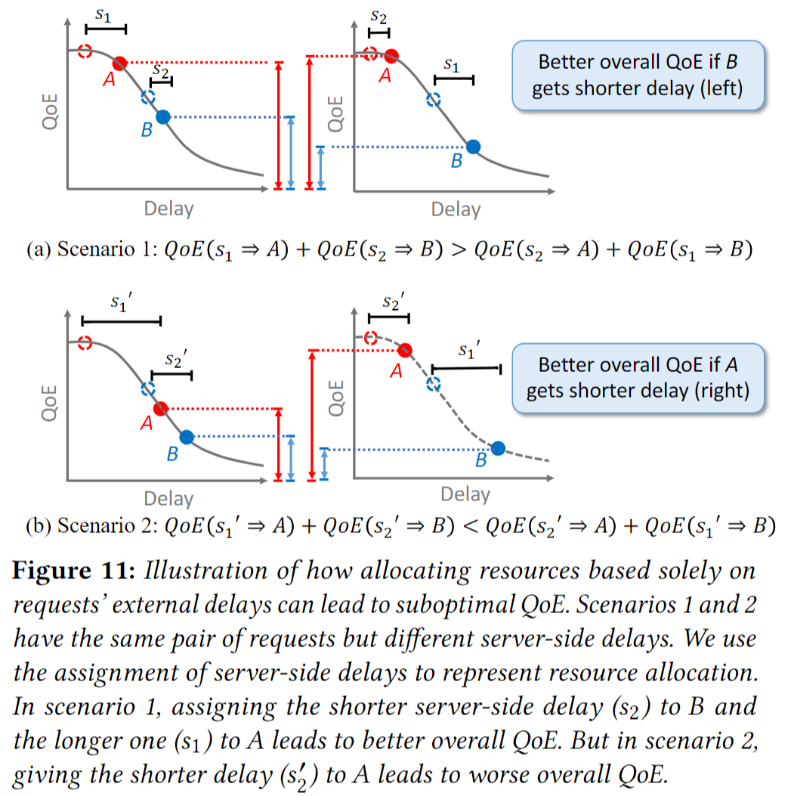

+++
title = "Literate Review of Related Works on NAI (Network-Application Integration)"
date = 2020-08-24T18:46:17-04:00
draft = false

# Tags and categories
# For example, use `tags = []` for no tags, or the form `tags = ["A Tag", "Another Tag"]` for one or more tags.
tags = ["reading", "literate review", "nai"]
categories = []

# Does this page contain bibtex? (true/false)
bibtex = true
references = ["ref/reading.bib"]

# Does this page contain LaTeX math? (true/false)
math = true

# Featured image
# To use, add an image named `featured.jpg/png` to your page's folder. 
[image]
  # Caption (optional)
  caption = ""

  # Focal point (optional)
  # Options: Smart, Center, TopLeft, Top, TopRight, Left, Right, BottomLeft, Bottom, BottomRight
  focal_point = ""
+++

Recently, my research interest moves to NAI (Network-Application
Integration), which we think will become a hot direction of networking
systems in the next few years. While it is not a totally new topic, because
of emerging application service architectures (*e.g.*, CDN, MEC, Live Video
Streaming, Cloud Gaming) and networking architectures (*e.g.*, Programmable
Dataplane, SD-WAN, Segment Routing, New IP), previous works may not work very
well.

To better understand new challenges on this direction, we make this literate
review. For each particular existing work, we try to figure out the following
questions:

- What is its design space?
  - In its design, which information is required to be fed by applications?
  - In its design, which information is required to be exposed by the network?
- What is its potential issues?
  - If possible, how easily can it be extended to other use cases?
  - Why it cannot work well in some cases?

## Related Works

As a starting point, we collect related works published on CoNEXT, SOSP,
NSDI, and SIGCOMM from 2007 to 2019.

The current literate review covers papers in the following list. And the list
may grow in the future, if we find more highly related works.



## Review Cards

### Wiser

**High-level Goal**: design a practical interdomain routing protocol that
enables ISPs to jointly control routing and compute good end-to-end paths
while acting in their own interest.

$$\text{cost}\_I = \min\_{paths} (\sum\_{p \in paths} \text{traffic}\_I(p) \times \text{intcost}\_I(p))$$

| Symbol                | Description |
| ----------------------| ------------|
| $I$                   | An ISP      |
| $paths$               | All possible end-to-end paths |
| $\text{cost}_I$       | Expected external cost for ISP $I$ |
| $\text{traffic}_I(p)$ | The rate of traffic carried along path $p$ over some period |
| $\text{intcost}_I(p)$ | The internal cost of path $p$ in ISP $I$ |

**Basic Idea**: Each ISP estimate its own external cost and advertise to its
neighbors the total cost to reach the destination. And each router selects
the lowest cost path.

**Potential Extension to NAI**: For ISPs serving their own CDN, those ISPs can
compute their own internal cost based on their CDN loads.

**Limitation**: Lowest-cost routing per destination may lead to congestion.

### Path Verification Mechanism (PVM)

### Cooperative IP Transit (CIPT)

### Timecard

### E2E

